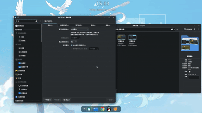
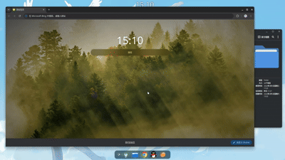
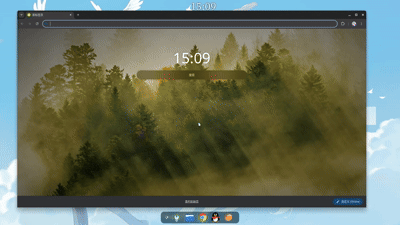

# Better Transition · 更好的过渡
>由DeepSeek V4.1 Flash 生成

一个 KWin / Plasma 6 桌面特效（C++ 插件）：**窗口被提升（raise）时，遮挡它的窗口先渐隐、停留片刻，再以原有顺序渐显回被提升窗口的下方**；如果被提升窗口几乎被完全遮挡，或者前方挡着一个巨大窗口，则改为对**被提升窗口自己**做缩放进入 / 淡入。

| | |
| --- | --- |
| 插件 id | `bettertransition` |
| 显示名称 | 更好的过渡 / Better Transition |
| 适用 | KWin / Plasma 6.7 Wayland |
| 许可 | GPL-2.0-or-later |

> 特效**不会**修改窗口的层叠顺序，只在动画期间临时改变绘制顺序、不透明度与缩放。

---

## 效果预览

### 普通提升：遮挡窗口渐隐 → 停留 → 在其后方渐显


### 巨大遮挡窗口：被提升窗口在提升那一帧淡入


### 几乎被完全遮挡：被提升窗口缩放进入


---

## 安装

### 1. 依赖

Debian / Ubuntu：

```bash
sudo apt install cmake g++ extra-cmake-modules kwin-dev \
    qt6-base-dev qt6-base-dev-tools libkf6config-dev libkf6configwidgets-dev \
    libkf6coreaddons-dev libkf6i18n-dev libkf6kcmutils-dev
```

其它发行版安装对应的 `kwin-dev`（KWin 头文件）、Qt 6 Base、KDE Frameworks 6（Config / ConfigWidgets / CoreAddons / I18n / KCMUtils）与 `extra-cmake-modules` 即可。

### 2. 构建并安装

一键：

```bash
./install.sh            # 构建 + 安装到 /usr
```

移动预构建文件至以下目录：

```
/usr/lib/x86_64-linux-gnu/qt6/plugins/kwin/effects/plugins/bettertransition.so
/usr/lib/x86_64-linux-gnu/qt6/plugins/kwin/effects/configs/kwin_bettertransition_config.so
```

## 3. 启用

安装完成后可在 设置-动效-桌面特效 页面启用

---

## 卸载

一键：

```bash
./uninstall.sh
```

手动删除插件文件
```bash
sudo rm -f /usr/lib/x86_64-linux-gnu/qt6/plugins/kwin/effects/plugins/bettertransition.so
sudo rm -f /usr/lib/x86_64-linux-gnu/qt6/plugins/kwin/effects/configs/kwin_bettertransition_config.so
```
